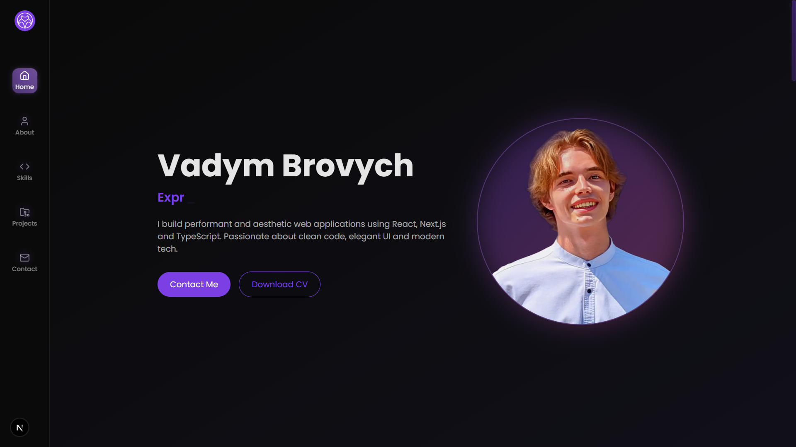

# 🌐 Personal Portfolio – Vadym Brovych

This is a **custom-built developer portfolio** built with **Next.js 15 (App Router)**, **Tailwind CSS**, and **Framer Motion**. It showcases my work, tech stack, and contact info in a clean, responsive layout with animated transitions and dynamic state tracking.


> 🔗 Live: [vadym-brovych.vercel.app](https://vadym-brovych.vercel.app/)

---

## 🖼️ UI Preview

| Hero Section | About Me |
|--------------|-------------|
|  |  |

| Skills Grid | Projects List |
|---------------|---------------|
|  |  |

---

## 🧰 Tech Stack

| Layer       | Technology                      |
|-------------|----------------------------------|
| Framework   | Next.js 15 (App Router)         |
| Styling     | Tailwind CSS                    |
| Animations  | Framer Motion                   |
| State Mgmt  | Zustand                         |
| Fonts       | Google Fonts (Poppins)          |
| Icons       | Lucide React, React Icons       |
| Deployment  | Vercel                          |

---

## ✨ Features

- 🧠 **Dynamic hero section** with Typewriter and hidden easter eggs
- ⚙️ **Scroll-aware sidebar** (desktop & mobile) with animated liquid effect
- 📂 **Modular project cards** with hover details and interactions
- 📱 **Fully responsive** layout with clean component design
- 📨 **Contact grid** with social links, hover effects, and call to action
- 🎨 **Dark-themed UI** with gradients and subtle shadows

---

## 🚀 Getting Started

```bash
git clone https://github.com/vadimBRR/portfolio-page.git
cd portfolio-page
npm install
npm run dev
````

The app runs locally at: `http://localhost:3000`

---

## 👤 Author

Developed by [Vadym Brovych](mailto:vadmabos.programming@gmail.com)
🗓️ July 2025